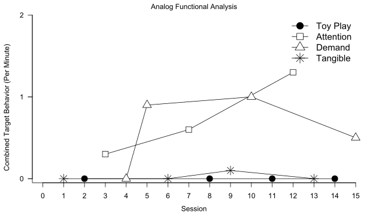
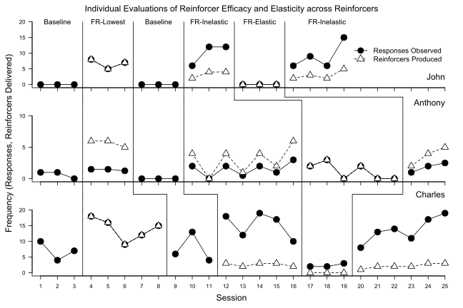
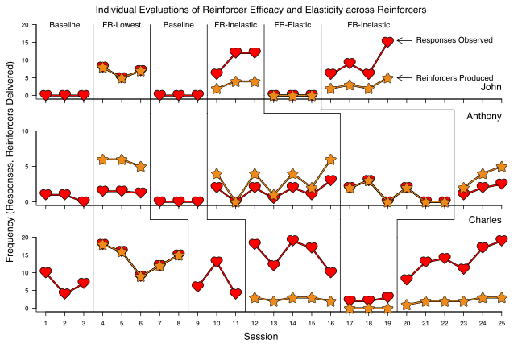
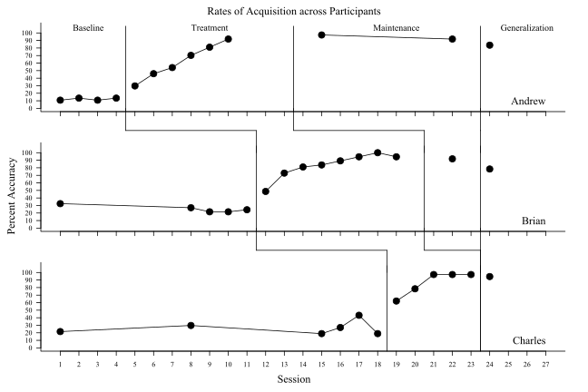
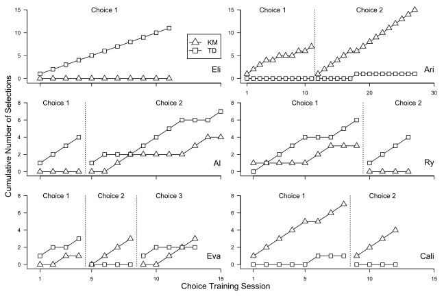

 

# Faux XL Charting in R (fxl)

The *fxl* package was designed to support transparent, replicable, and efficently-drawn figures that include conventions common in applied behavior analysis. The goals of the package are to (1) provide an interface to figure conventions (e.g., precise phase change lines) that are not natively supported in any existing software and (2) assist in clinical work by automating aspects of research and practice that rely on visual analysis and single-case research designs. The commands, code structure, and features are designed with the unique needs of behavior analysts, educational consultants, and other professionals that versed in the application of single-case design. The product of the *fxl* package is publication-quality figures at densities that exceed traditional tools (e.g., MS Excel, GP Prism) and can be exported in a variety of lossless (i.e., vector), lossy (i.e., raster), and a variety of formats relevant to academic work.

Some relevant features include:

-   Support for all common single-case research designs, e.g. reversal/withdrawal, multiple baselines, alternating treatments, and changing criterion.
-   Support for common assessments and visualizations, e.g. functional analysis and concurrent chains.
-   Phase change lines -- yes, actual support for phase change lines (no hacky macros or manual construction)
-   Extensive options for dynamically annotating facets (e.g., targets, participants), phases (e.g., baseline, treatment 1, treatment 2), and describing individual sessions (e.g., T'ed with early termination)
-   Behavior analytic conventions for visually describing schedule thinning, demand fading, and other common procedures (e.g., arrows, brackets, style condition changes)

## Version

------------------------------------------------------------------------

0.4.2 (beta)

## Changelog

------------------------------------------------------------------------

-   0.4.2 - Add in support for custom images and markers
-   0.4.1 - Removing older dependencies out, building out vignettes
-   0.4.0 - Added testing, convenience wrappers
-   0.3.1 - Updates for padding, margins, rich expression mappings
-   0.3.0 - Add in demo for completed silverman-style plot
-   0.2.0 - Add in various demos (e.g., multiple baseline, annotated reversal)
-   0.1.0 - Prep for initial submission to CRAN

## Example Usage

------------------------------------------------------------------------

### Hybrid Experimental Designs (Multiple Baseline + Reversal)

The figure below is from a single-subject evaluation conducted by [Gilroy et al. (2019)](https://doi.org/10.1080/17518423.2019.1646342) and drawn in *fxl*. The goal of this study was to demonstrate how an operant behavioral economic approach can be used in conjunction with functional communication training. The figure illustrated below uses *fxl* to illustrate a combination of multiple baseline features as well as a reversal to demonstrate at least 3 demonstrations of control. This figure features dynamic phase change lines, phase change lines varying in style, annotated text and arrows/brackets, and facet/phase labels.

The source code necessary to re-create the figure is provided below (data included in the package).

[Code to Draw Figure](https://github.com/miyamot0/fxl/blob/main/demo/annotatedplot.R)

### Alternating Treatment Design/Functional Analysis

The figure below represents the results of a functional analysis also conducted by [Gilroy et al. (2019)](https://doi.org/10.1080/17518423.2019.1646342) and drawn in *fxl*. Specifically, the functional analysis conducted by [Gilroy et al. (2019)](https://doi.org/10.1080/17518423.2019.1646342) was designed to experimentally determine the function of a child's aggressive behavior. This figure visualizes multiple data series (i.e., each representing a distinct condition) as well as a customized legend to contextualize results. Markers and lines are fully customizable and tailored to the conventions common in functional analysis.

The source code necessary to re-create the figure is provided below (data included in the package).

[Code to Draw Figure](https://github.com/miyamot0/fxl/blob/main/demo/faplot.R)

{alt="Gilroy et al 2019"}

### *Hybrid Functional Analysis (Behavior and Procedural Integrity)*

As an added layer of functionality, multiple types of data visualization can be combined in a common plot. The figure shown above, functional analysis, can be illustrated along with additional information related to procedural integrity. Such information is often helpful when making inferences from functional analyses by those not typically trained to do so (e.g., parents, teachers).

The source code necessary to create such a figure is provided below (data included in the package).

[Code to Draw Figure](https://github.com/miyamot0/fxl/blob/main/demo/faplotintegrity.R)

{alt="Gilroy et al 2019"}

### Reversal Design, Concurrent across Participants

The figure below is from a single-subject evaluation conducted by [Gilroy et al. (2021)](https://doi.org/10.1002/jaba.826) and drawn in *fxl*. The goal of this study was to explore how unit price and price elasticity affects work output in the context of behavioral intervention. The figure illustrated below uses *fxl* to illustrate a combination of individual reversals, visualized in a way to facilitate visual analysis across phases and participants to evaluate how degrees of demand elasticity influence rates of behavior emitted across schedules. This figure features dynamic phase change lines across participants, multiple target lines/markers, and facet/phase labels.

The source code necessary to re-create the figure is provided below (data included in the package).

[Code to Draw Figure](https://github.com/miyamot0/fxl/demo/concurrentplot.R)

### Custom Images for Figures

Building upon the prior example, figures can be constructed using custom markers and images as well. Specifically, an RGML file (an xml file that tells R how to draw an image) made from either a vector-based or raster can be used in place of a point or marker. The previous example is re-drawn with custom markers for the figure presented here.

The source code necessary to re-create the figure is provided below (data included in the package).

[Code to Draw Figure](https://github.com/miyamot0/fxl/blob/main/demo/concurrentplot_fun.R)

### Multiple Baseline Designs

The figure below is based on data from [Gilroy et al. (2015)](https://doi.org/10.1016/j.rasd.2015.04.004) and is drawn in *fxl*. The goal of this study was to explore whether a relational training procedure could be used to teach autistic children to demonstrate behavior consistent with Theory of Mind (derived relational responding via deictic frames). The figure illustrated below uses *fxl* to illustrate a multiple baseline design, whereby demonstrations of control take place across participants through a systematic introduction of the independent variable (i.e., relational training procedure). This figure features dynamic phase change lines across participants and facet/phase labels.

The source code necessary to re-create the figure is provided below (data included in the package).

[Code to Draw Figure](https://github.com/miyamot0/fxl/blob/main/demo/multiplebaselineplot.R)

### Concurrent Choice/Initial Link Selections

The figure below is based on data from [Lozy et al. (2020)](https://doi.org/10.1002/jaba.677) and drawn using *fxl*. The goals of this study were to compare outcomes and preferences from two different methods of teaching letter--sound correspondence and word recognition for preschool children. The figure illustrated below uses *fxl* to illustrate the results of concurrent chain procedures across each participant. This figure features multiple panels specific to participants (i.e., multiple rows and columns), dynamic phase change lines across participants, and facet/phase labels that indicate conditions varying across participants.

The source code necessary to re-create the figure is provided below (data included in the package).

[Code to Draw Figure](https://github.com/miyamot0/fxl/blob/main/demo/cumulativeplot.R)

{alt="Lozy et al 2020"}

### Silverman-Styled Dot Plots

The figure below is based on data from [Koffarnus et al. (2011)](https://doi.org/10.1093/alcalc/agr057) and drawn using *fxl*. The goal of this study was to draw comparisons between three different work training programs designed to address substance use behavior. The plots used in this study, popularized by Kenneth Silverman, are fully supported in *fxl*. This figure type communicates behavior status via dots, whereby each increment on the ordinate reflects a distinct individual and each on the abscissa a measure of behavior for each unit change in time. This figure illustrates individual participant data, across groups, over the course of an experimental trial.

The source code necessary to re-create the figure is provided below (data included in the package).

[Code to Draw Figure](https://github.com/miyamot0/fxl/blob/main/demo/silvermanplot.R)

{alt="Koffarnus et al 2011"}

### Multilevel Modeling of Fixed Effects in Single Case Designs

The figure below was drawn for [Gelino et al. (2022)](https://doi.org/10.1002/jaba.967) using *fxl*. The goal of this study was to evaluate outcomes from a policy initiative designed to address cigarette smoking behavior on a large college campus. In addition to visualizing grand means across multiple targeted sites, the *fxl* package was used to draw the fitted estimates from multilevel modeling in *R* atop the empirical data.

The source code necessary to re-create the figure is provided below (data included in the package).

[Code to Draw Figure](https://github.com/miyamot0/fxl/blob/main/demo/cigarettepolicy.R)

### *Celeration (Semi-logarithmic) Charts*

Standard celeration charts are a type of visualization highly specific to behavior analytic use. Specifically, this semi-logarithmic visualization using logarithmic scaling to support visual changes in behavior over time in terms of relative change on the ordinate (linear change on the abscissa). An example of this type of charge is displayed below with simulated changes in behavior at low (0-2x/session) and high rates (\~100-200x/session) along with phase change lines and text annotations.

The source code necessary to re-create the figure is provided below (data included in the package).

[Code to Draw Figure](https://github.com/miyamot0/fxl/blob/main/demo/semilogplot.R)

## Referenced Works (F/OSS software)

------------------------------------------------------------------------

The fxl package incorporates a number of open-source projects to work properly. Specifically, the core design and overall engine was modeled from Hadley Wickham's ggplot. Attempts were made to accomplish these features in ggplot alone doing so required deviating from low-level functionality in ggplot. The TeachingDemos package was referenced for code that translates coordinates from multiple view devices.

The specific software referenced is provided credit below:

-   ggplot2 - MIT Licensed. [Site](https://github.com/tidyverse/ggplot2)
-   TeachingDemos - Artistic 2.0 Licensed. [Site](https://cran.r-project.org/web/packages/TeachingDemos/index.html)

## Referenced Works (Other Assets)

The specific assets embedded in this work are credited below:

-   Star SVG Vector - CC0 Licensed. [Site](https://www.svgrepo.com/svg/13695/star)
-   Like SVG Vector - CC0 Licensed. [Site](https://www.svgrepo.com/svg/13653/like)

## Installation

------------------------------------------------------------------------

At present, the *fxl* package is not yet part of CRAN. The package must be installed manually at this time, using the *devtools* package. Example installation instructions using *devtools* are provided in source code form below.

    library(devtools)

    install_github("miyamot0/fxl")

## Development

------------------------------------------------------------------------

Want to contribute? Great! Emails or PR's (worthwhile ones) are welcome.

## TODOs

------------------------------------------------------------------------

-   Working to 100% coverage.
-   Building out vignettes for more complete example usage.

## License

------------------------------------------------------------------------

*fxl* - Copyright 2021, Shawn P. Gilroy. GPL-Version 2+
