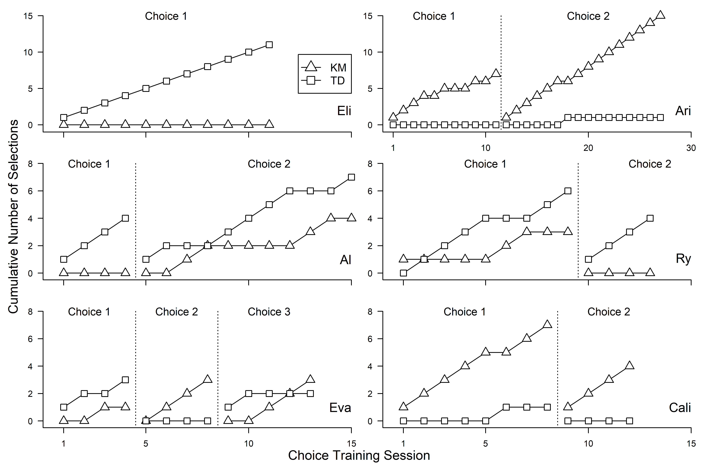
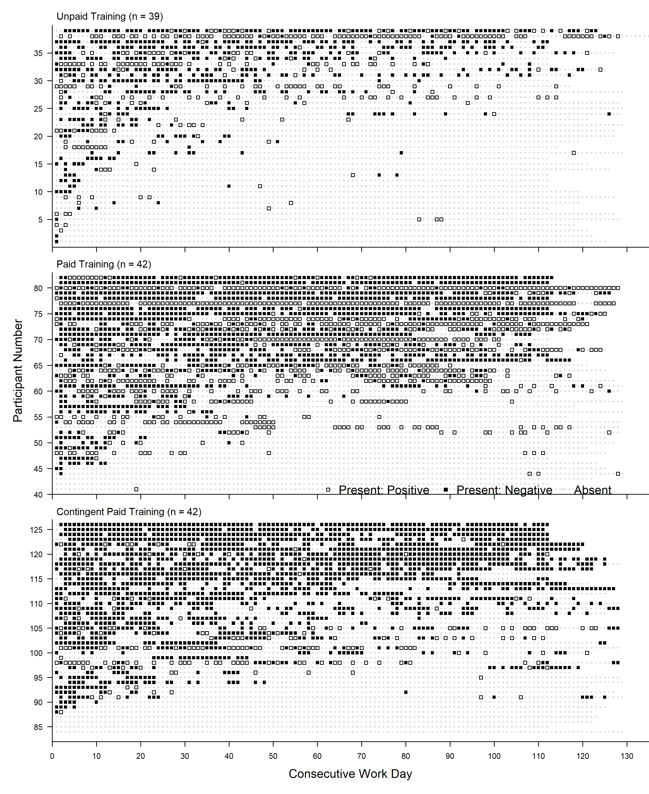

 

# Faux XL Charting in R (fxl)

The *fxl* package was designed to support transparent, replicable, and efficently-drawn figures that feature conventions common in applied behavior analysis.

The goals of the package are to:

-   Provide an dedicated interface to conventions that are not natively supported in any existing software (e.g., precise phase change lines)

-   Assist in clinical work by automating aspects of research and practice that rely on visual analysis and single-case research designs. The commands, code structure, and features are designed with the unique needs of behavior analysts, educational consultants, and other professionals that use single-case research designs as part of their work.

-   Generate publication-quality figures in formats and densities that exceed traditional tools (e.g., MS Excel, GP Prism).

Some highlighted features of the *fxl* package include:

-   Support for natively rendering all common single-case research designs (e.g. reversal/withdrawal, multiple baselines, alternating treatments, and changing criterion) from straight-forward R syntax.

-   Conventions and methods that streamline and automate the visualization of common assessments (e.g. functional analysis, concurrent chains) directly from R syntax.

-   Native support for drawing of cross-panel phase change lines -- YES, actual support for phase change lines. No manual construction, no repeated adjustments, and no hacky macros that make your machine insecure.

-   Intuitive mapping approach that communicates how to prepare individual subplots/facets (e.g., targets, participants), separate data series in terms of phases (e.g., baseline, treatment 1, treatment 2), and the sequencing of individual sessions (e.g., T'ed with early termination).

-   Extensive options for various chart annotations that consistent with how behavior analysts visually communicate events such as schedule thinning, demand fading, and other common events (e.g., arrows, brackets, style condition changes).

## Current Version

0.7.0 (beta)

## Changelog

-   0.7.0 - Bump to add fix for *scr_arrows*

-   0.6.3 - CRAN fixes

-   0.6.0 - Initial build for CRAN

-   0.5.2 - Introduction of *scr_rect*, added use case 2 to vignette (multiple baseline)

-   0.5.1 - Fixes for instances w/o facets, imagines. Added example to vignette

-   0.5.0 - Support for dynamic point/bar colors, sizes, etc. via lambda

-   0.4.3 - Vignette and example figure expansion

-   0.4.2 - Add in support for custom images and markers

-   0.4.1 - Removing older dependencies out, building out vignettes

-   0.4.0 - Added testing, convenience wrappers

-   0.3.1 - Updates for padding, margins, rich expression mappings

-   0.3.0 - Add in demo for completed Silverman-style plot

-   0.2.0 - Add in various demos (e.g., multiple baseline, annotated reversal)

-   0.1.0 - Prep for initial submission to CRAN

## Example Usage

### Custom Experimental Designs (e.g., Multiple Baseline + Reversal)

The figure below is generated from data featured in a single-subject evaluation conducted by [Gilroy et al. (2019)](https://doi.org/10.1080/17518423.2019.1646342) and redrawn using *fxl*.

The goal of this study was to demonstrate how an operant behavioral economic approach can be used in conjunction with functional communication training. There was two functions to address per functional analysis and three demonstrations of control were accomplished using a combination of multiple base and reversals.

The figure illustrated below uses *fxl* to illustrate a combination of multiple baseline features as well as a reversal. This figure features dynamic phase change lines, phase change lines varying in style, annotated text and arrows/brackets, and facet/phase labels.

The source code necessary to re-create the figure is provided below (data included in the package).

[Code to Draw Figure](https://github.com/miyamot0/fxl/blob/main/demo/annotatedplot.R)


### Alternating Treatment Design/Functional Analysis

The figure below illustrates the results of functional analysis. These data were also featured in the study conducted by [Gilroy et al. (2019)](https://doi.org/10.1080/17518423.2019.1646342) and drawn using *fxl*. The functional analysis conducted by [Gilroy et al. (2019)](https://doi.org/10.1080/17518423.2019.1646342) was designed to experimentally determine the function of an autistic child's aggressive behavior towards their family.

This figure visualizes multiple data series that each represent a distinct condition and a legend is used to communicate what each type of data series reflects. Markers and lines feature customization, and for the example included below, correspond with the conventions common in functional analyses in published works.

The source code necessary to re-create the figure is provided below (data included in the package).

[Code to Draw Figure](https://github.com/miyamot0/fxl/blob/main/demo/faplot.R)


### Custom Functional Analysis (i.e., integrated display of behavior and procedural integrity)

As an added layer of functionality, multiple layers of related data may be drawn on a single feature. In the case of functional analyses conducted by non-behavior analysts (e.g., caregivers), the degree to which non-professionals implement functional analysis procedures is directly related to how the learner behaves in those conditions. That is, rates of behavior may be *elevated or depressed* not because of the programmed contingencies but instead the *deviations* from those contingencies.

Additional information related to the functional analysis (e.g., percentage correct implementation) can be drawn alongside behavior rates using the *fxl* package.

The source code necessary to create such a figure is provided below (data included in the package).

[Code to Draw Figure](https://github.com/miyamot0/fxl/blob/main/demo/faplotintegrity.R)


## Concurrent Reversal Design across Participants

The figure below is built using data featured in a single-subject research design conducted by [Gilroy et al. (2021)](https://doi.org/10.1002/jaba.826) and drawn using *fxl*.

The goal of this study was to explore how unit price and price elasticity affects work output in the context of behavioral intervention. The figure illustrated below is drawn using *fxl* to illustrate a combination of individual reversals, visualized in a way to facilitate visual analysis across phases and participants to evaluate how degrees of demand elasticity influence rates of behavior emitted across schedules. This figure features dynamic phase change lines across participants, multiple target lines/markers, and facet/phase labels.

The source code necessary to re-create the figure is provided below (data included in the package).

[Code to Draw Figure](https://github.com/miyamot0/fxl/blob/main/demo/concurrentplot.R)


### Fully Customizable Markers and Plot Elements

The *fxl* package allows for custom images to be used as markers in research designs. Occasionally, a lighter and more friendly presentation may assist with communicating individual performance (e.g., performance feedback for younger learners). Specifically, an RGML file (i.e., an R [G]raphical [M]arkup [L]anguage file that uses the XML standard) is used to instruct R how to draw images. Images can be supplied by the user and can feature either vector-based or rasters.

The two examples featured below demonstrate this functionality and the source code necessary to re-create them is provided as well (all data included in the package).

[Code to Draw Figure](demo/concurrentplot_fun.R)


[Code to Draw Figure](demo/atd_example_fun.R)


### Multiple Probe/Multiple Baseline Design

The figure below is built from data featured in [Gilroy et al. (2015)](https://doi.org/10.1016/j.rasd.2015.04.004) and drawn using *fxl*.

The goal of this study was to explore whether a relational training procedure could be used to teach autistic children to demonstrate behavior consistent with Theory of Mind (i.e., derived relational responding via deictic frames). The figure illustrated below uses *fxl* to illustrate a multiple probe design, whereby the three demonstrations of control take place across participants through the systematic introduction of the independent variable (i.e., relational training procedure). This figure features dynamic phase change lines across participants, dynamically positioned phase change labels, and facet labels.

The source code necessary to re-create the figure is provided below (data included in the package).

[Code to Draw Figure](https://github.com/miyamot0/fxl/blob/main/demo/multiplebaselineplot.R)


### Multiple Baseline Design with Annotations

Oftentimes there is a need to 'grey out' portions of a single-case figure to indicate that a certain event or procedure took place. For example, throughout the course of a research design, there may be periods of time where procedures have taken place but the dependent variable of interest is not captured (e.g., training sessions prior to formally introducing and independent variable). This is often appreciated to communicate to the analyst that something did or did not take place immediately prior to collecting information related to intervention (e.g., training prior to intervention vs. proceeding immediately from baseline to intervention). An example of such is illustrated below and drawn using *fxl*.

The source code necessary to re-create the figure is provided below (data included in the package).

[Code to Draw Figure](https://github.com/miyamot0/fxl/blob/main/demo/greyed_training.R)


### Changing Criterion Design with Annotations

The changing criterion design is another popular approach for parametrically evaluating the effects of some independent variable (e.g., reinforcement schedule) on behavior. The figure below simulates the use of the design and features a baseline phase, individual phases depicting levels of an independent variable (e.g., Fixed Ratio [FR]24 vs FR36). In addition to features common in other designs, this figure features annotations that reflect the level of behavior necessary to produce access to the reinforcer (e.g., an underlying line below the observed data). This added layer, the *scr_criterion_lines* call, involves specifying a styled line (e.g., *x1*, *x2*, *level*) using named lists. The result of which is a series of annotations that correspond to each phase and can be styled in terms of line color (*color*), width (*size*), and other features (e.g., linetype [*lty*]).

The source code necessary to re-create the figure is provided below (data included in the package).

[Code to Draw Figure](https://github.com/miyamot0/fxl/blob/main/demo/changing_criterion.R)


### Concurrent Choice/Initial Link Selections

The figure below was generated using data featured in [Lozy et al. (2020)](https://doi.org/10.1002/jaba.677) and drawn using *fxl*.

The goals of this study were to compare outcomes and preferences from two different methods of teaching letter--sound correspondence and word recognition in preschool children. The figure illustrated below uses *fxl* to illustrate the results of concurrent chain procedures across each participant. This figure features multiple panels specific to participants (i.e., multiple rows and columns), dynamic phase change lines across participants, and facet/phase labels that indicate conditions varying across participants.

The source code necessary to re-create the figure is provided below (data included in the package).

[Code to Draw Figure](https://github.com/miyamot0/fxl/blob/main/demo/cumulativeplot.R)



### Silverman-Styled Dot Plots

The figure below is designed using data featured in [Koffarnus et al. (2011)](https://doi.org/10.1093/alcalc/agr057) and furnished by the lead author of the study. The figure below was redrawn using *fxl* with the supplied data.

The goal of this study was to draw comparisons between three different structured work training programs that were designed to address substance use behavior. The plot styles used in this figure, originally popularized by Kenneth Silverman, are fully supported in *fxl*. Specifically, this type of figure communicates outcomes and/or behavior status using styled dots whereby each increment on the ordinate reflects a distinct individual (e.g., 5 vs. 6 on y-axis) and each on the abscissa a measure of behavior for each unit change in time (e.g., 3 vs. 4 on x-axis). This figure illustrates individual participant data, across groups, over the course of an experimental trial.

The source code necessary to re-create the figure is provided below (data included in the package).

[Code to Draw Figure](https://github.com/miyamot0/fxl/blob/main/demo/silvermanplot.R)



### Multilevel Modeling of Fixed Effects in Single Case Designs

The figure below using data featured in [Gelino et al. (2022)](https://doi.org/10.1002/jaba.967). The *fxl* was used to generate the figures used in this publication.

The goal of this study was to evaluate outcomes from a policy initiative designed to curb cigarette smoking behavior on a large college campus. In addition to visualizing population-level estimates across multiple targeted sites, the *fxl* package was used to draw the fitted estimates from multilevel modeling in *R* atop the empirical data.

The source code necessary to re-create the figure is provided below (data included in the package).

[Code to Draw Figure](https://github.com/miyamot0/fxl/blob/main/demo/cigarettepolicy.R)


### Celeration (Semi-logarithmic) Charts - Individualized

Celeration charts are not often observed outside of niche applications in behavior analysis. However, semi-logarithmic charts (i.e., partial elasticity) are quite common in many other domains (e.g., economics). Part of the challenge associated with the use of celeration charts is the handling of zero values, which is not easily remedied in traditional spreadsheet software.

The figure below illustrates a hypothetical example of group-wide progress monitoring using celeration charts (i.e., reading indicators). This is visualized using a combination of line annotations, phase change labels, and other features illustrating the logarithmic scaling.

The source code necessary to re-create the figure is provided below (data included in the package).

[Code to Draw Figure](https://github.com/miyamot0/fxl/blob/main/demo/reports_academic_rti.R)


### Celeration (Semi-logarithmic) Charts - Multiple (Groups/Individuals)

Semi-logarithmic charts are useful for evaluating relative change over time and these are particularly suited to fluency-based interpretations over time. An example of this type of chart is displayed below with simulated changes in the rate of reading fluency across classrooms in a multiple baseline design. This chart leverages additional functionality from *fxl*; specifically, the celeration interpretation is presented within a multiple baseline display, with phase/facet labels, phase change lines, and a dynamic coding of individual data points (each a student) based on how their fluency ranks against known criteria.

The source code necessary to re-create the figure is provided below (data included in the package).

[Code to Draw Figure](https://github.com/miyamot0/fxl/blob/main/demo/reports_academic_rti.R)


## Referenced Works (F/OSS software)

The fxl package incorporates a number of open-source projects to work properly. Specifically, the core design and overall engine was modeled from Hadley Wickham's *ggplot*. Attempts were made to accomplish the features in this package within *ggplot* proper; however, doing so was not straightforward and would have required deviating from low-level functionality built into *ggplot*.

The *TeachingDemos* package was referenced for code that translates coordinates from multiple view devices.

The specific software referenced is provided credit below:

-   ggplot2 - MIT Licensed. [Site](https://github.com/tidyverse/ggplot2)

-   TeachingDemos - Artistic 2.0 Licensed. [Site](https://cran.r-project.org/package=TeachingDemos)

## Referenced Works (Other Assets)

The specific assets embedded in this work are credited below:

-   Scorpion SVG - CC0 Licensed. [Site](https://www.svgrepo.com/svg/404093/scorpion)

-   Skinner SVG - Public Domain Licensed. [Site](https://thenounproject.com/icon/bf-skinner-2029708/)

-   Star SVG - CC0 Licensed. [Site](https://www.svgrepo.com/svg/13695/star)

-   Like SVG - CC0 Licensed. [Site](https://www.svgrepo.com/svg/13653/like)

## Installation

At present, the *fxl* package is not yet featured as a part of CRAN. This is purely due to the rapid cycle of growth of features being added to the project. The package must be installed manually at this time using the *devtools* package.

Example installation instructions using *devtools* are provided in source code form below.

```         
library(devtools)

install_github("miyamot0/fxl")
```

## Development

Want to contribute? Great! Emails or PR's (adding useful/desired functionality) are welcome.

## TODOs

-   Working to 100% coverage.

-   Building out vignettes for more complete example usage.

## License

*fxl* - Copyright 2021, Shawn P. Gilroy. GPL-Version 2+
